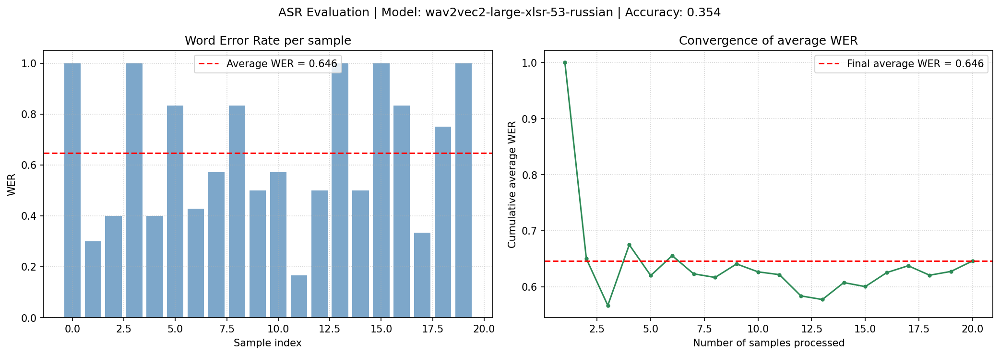

# 🎙️ Russian Speech Recognition Pipeline (PyTorch)

A full pipeline for **Russian speech recognition (ASR)** using PyTorch and Wav2Vec2.

This project supports:
- 📦 Loading speech datasets from Parquet (Golos dataset)
- 🔊 Audio preprocessing (any format: mp3, wav, flac, etc.)
- 🧠 Speech-to-text transcription (ASR)
- 📊 Evaluation using Word Error Rate (WER)
- ⚡ GPU acceleration support

---

## 🚀 Features

- Works with local **Golos dataset**
- Automatic audio preprocessing:
  - Resampling to 16kHz
  - Mono conversion
- Pretrained Wav2Vec2 model for Russian ASR
- WER evaluation for model quality
- CUDA support (if available)

---

## 🧠 Tech Stack

- PyTorch (`torch`)
- torchaudio
- Hugging Face Transformers
- Hugging Face Datasets
- librosa / soundfile (audio decoding support)

---

## ⚙️ Installation

Install dependencies:

```bash
pip install torch torchaudio transformers datasets librosa soundfile
```

## 📊 WER Visualization



After running the evaluation script, a PNG file with two plots is generated to visualize the model's Word Error Rate (WER) and accuracy.

### Generated Plots

1. **WER per sample (bar chart)**  
   Shows the individual WER for each audio sample with a dashed red line indicating the average.

2. **Cumulative average WER (line plot)**  
   Illustrates how the average WER converges as more samples are processed.

The overall **accuracy** is calculated as `1 − average WER` and displayed in the figure title.